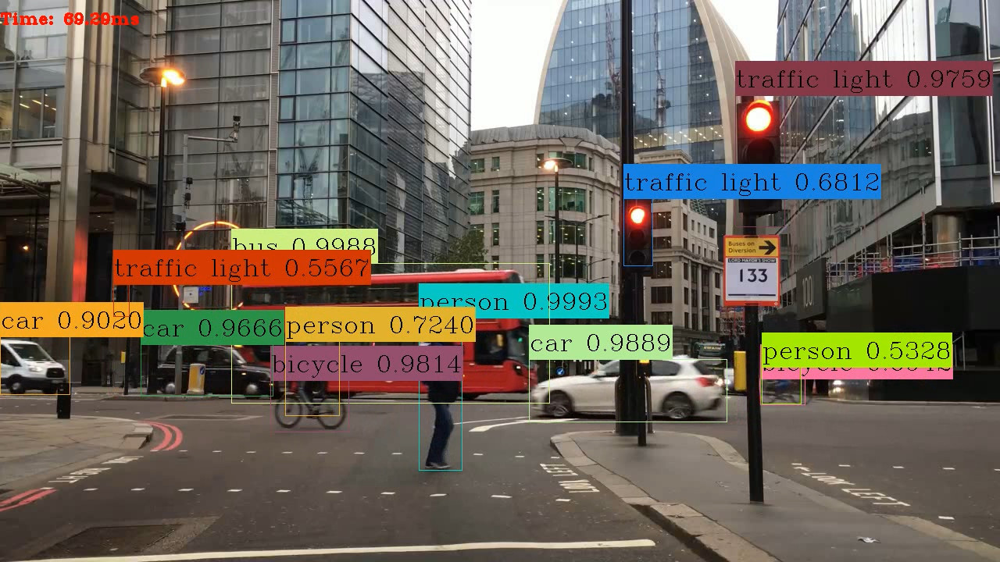

# YoloV3 Implementation in Tensorflow 2.x

See on YouTube: [4K YoloV3 Object detection using Tensorflow 2.1](https://www.youtube.com/watch?v=2Xc9oj2qMRc)

This repo provide a clean implementation of YoloV3 in Tensorflow 2.x using all the best practices.




## Key Features

- [x] TensorFlow 2.1
- [x] `yolov3` with pre-trained Weights
- [ ] `yolov3-tiny` with pre-trained Weights
- [x] Inference example
- [x] Transfer learning example
- [ ] Eager mode training with `tf.GradientTape`
- [ ] Graph mode training with `model.fit`
- [x] Functional model with `tf.keras.layers`
- [x] Input pipeline using `tf.data`
- [x] Tensorflow Serving
- [ ] Vectorized transformations
- [x] GPU accelerated
- [x] Fully integrated with `absl-py` from [abseil.io](https://abseil.io)
- [x] Clean implementation
- [x] Following the best practices
- [x] MIT License


## Usage

### Installation

#### Pip

```bash
# without GPU
pip install -r requirements.txt
#with GPU
pip install -r requirements-gpu.txt
```

### Nvidia Driver (For GPU)

```bash
# Ubuntu 18.04
sudo apt-add-repository -r ppa:graphics-drivers/ppa
sudo apt install nvidia-driver-440
# Windows/Other
https://www.nvidia.com/Download/index.aspx
```

### Convert pre-trainned Darknet weights

```bash
# yolov3
wget https://pjreddie.com/media/files/yolov3.weights -O data/yolov3.weights
python convert.py --weights ./data/yolov3.weights --output ./checkpoints/yolov3.tf
```

### Detection 

```bash
# WebCam
python object_detected.py --video 0

# Video file
python object_detected.py --video path_to_file.mp4

# Vidoe file with output
python object_detected.py --video path_to_file.mp4 --output ./output.avi
```

### Training 

soon


## Implementation Details

### Eager execution

Great addition for existing Tensorflow experts.

It is annoying when you accidentally use incompatible feature like
`tf.config.experimental.set_memory_growth(devices[0], True)` or some sort of python 
control flow that works fine eager mode.

### models(x) vs model.predict(x)

When calling `model(x)` directly, we are executing the graph in eager mode. For
`model.predict`, tf actually compile the graph on the first run and then execute
in graph mode. so if you are running the momdel once, `model(x)`, is faster since there is no compilation needed. Otherwise, `model.predict(x)` or using exported SavedModel graph is much faster (by x2). For no real-time usage, `model.predict_on_batch` is even faster as tested by @AnaRhisT94)

### absl.py (abseil)

Absolutely amazing. If you don't know already, absl.py is officially used by
internal projects at Google. It standardizes application interface for Python
and many other languages. After using it within Google, I was so excited
to hear abseil going open source. It includes many decades of best practices
learned from creating large size scalable applications. I literally have
nothing bad to say about it, strongly recommend absl.py to everybody.

### Loading pre-trained Darknet weights

very hard with pure functional API because the layer ordering is different in
tf.keras and darknet. The clean solution here is creating sub-models in keras.
Keras is not able to save nested model in h5 format properly, TF Checkpoint is
recommended since its offically supported by TensorFlow.

### tf.keras.layers.BatchNormalization

It doesn't work very well for transfer learning. There are many articles and
github issues all over the internet. I used a simple hack to make it work nicer
on transfer learning with small batches.

## Command Line Args Reference

```bash
convert.py:
  --output: path to output
    (default: './checkpoints/yolov3.tf')
  --weights: path to weights file
    (default: './data/yolov3.weights')
  --num_classes: number of classes in the model
    (default: '80')
    (an integer)


detect_video.py:
  --classes: path to classes file
    (default: './data/coco.names')
  --video: path to input video (use 0 for cam)
    (default: './data/video.mp4')
  --output: path to output video (remember to set right codec for given format. e.g. XVID for .avi)
    (default: None)
  --output_format: codec used in VideoWriter when saving video to file
    (default: 'XVID')
  --weights: path to weights file
    (default: './checkpoints/yolov3.tf')
  --num_classes: number of classes in the model
    (default: '80')
    (an integer)

```

# Change Log

#### May 25, 2020

- Updated to Tensorflow to v2.1.0 Release


## References

It is pretty much impossible to implement this from the yolov3 paper alone. 

- https://github.com/pjreddie/darknet
    - official yolov3 implementation
- https://github.com/AlexeyAB
    - explinations of parameters
- https://github.com/qqwweee/keras-yolo3
    - models
    - loss functions
- https://github.com/YunYang1994/tensorflow-yolov3
    - data transformations
    - loss functions
- https://github.com/ayooshkathuria/pytorch-yolo-v3
    - models
- https://github.com/broadinstitute/keras-resnet
    - batch normalization fix
- https://github.com/zzh8829/yolov3-tf2
	- tiny
